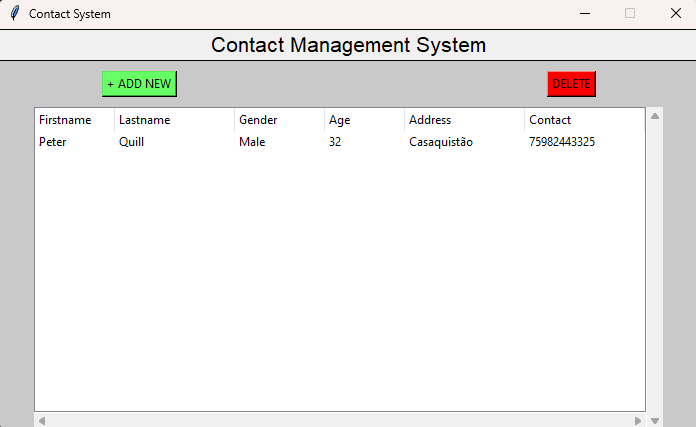

EN-US
# Contact Management System Project in Python
This Contact Management System is a Python program that can manage the list of contact information.

# About the Project
The project is a simple GUI application that uses the Tkinter module in order to create a design view. The system can be accessed without the use of login information. The user can add a new contact by providing personal details such as first name, last name, gender, address, and contact number. The system table can also be updating the contact list if he/she double click the row of that particular data.

# Features:
* The user can view the list of all contact as soon as the application has launched.
* You can freely add more contacts by supplying the needed details.
* The system has a function that can update the list of contact by double-clicking the targeted row and change the data in the input field.
* The system also allowed to delete some contact by clicking the targeted row and click the delete button

# Note:
I tried to develop the project focusing on the English language, as I believe it makes it more semantic.

-------------------------------------------------------------------------------------------------------------------------------------------------------------------------------------------------------------------------------------------------------------------

PT-BR
# Projeto de Sistema de Gerenciamento de Contatos em Python
Este Sistema de Gerenciamento de Contatos é um programa em Python que pode gerenciar a lista de informações de contato. O objetivo do sistema é organizar a lista de todos os contatos disponíveis, como inserindo nomes e números de telefone. Este programa foi desenvolvido usando apenas a linguagem Python.

# Sobre o Projeto
O projeto é uma aplicação simples de interface gráfica (GUI) que usa o módulo Tkinter para criar a visualização. O sistema pode ser acessado sem o uso de informações de login. O usuário pode adicionar um novo contato fornecendo detalhes pessoais, como nome, sobrenome, gênero, endereço e número de contato. A tabela do sistema também pode ser atualizada clicando duas vezes na linha dos dados específicos.

# Funcionalidades:
* O usuário pode visualizar a lista de todos os contatos assim que a aplicação for iniciada.
* Você pode adicionar novos contatos livremente fornecendo os detalhes necessários.
* O sistema tem uma função que permite atualizar a lista de contatos ao clicar duas vezes na linha desejada e alterar os dados no campo de entrada.
* O sistema também permite excluir algum contato ao clicar na linha desejada e pressionar o botão de exclusão.

# Nota:
Tentei fazer focando na lingua inglesa pois creio ficar mais semântico.

